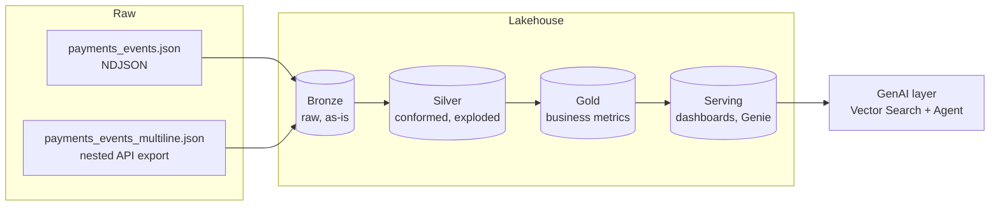

# NovaLake

A hands-on Databricks lakehouse build, end to end: raw event data → Bronze → Silver →
Gold → Serving → orchestration (Jobs, then Declarative Pipelines) → a GenAI layer on
top of the same curated data. Built on **Databricks Free Edition**, documented as it's
built, every transformation and decision versioned in this repo.

NovaLake is the analytical/AI counterpart to **[NovaPay](#)** (a separate
production-style payments platform project) — NovaPay generates the operational
event stream; NovaLake is the lakehouse that turns it into business metrics, served
dashboards, and a support-assist AI agent.

## Why this exists

A structured way to go deep on Databricks: not tutorials, a real (synthetic) messy
dataset, transformed by hand through every layer before any orchestration or
automation is introduced — so each abstraction is understood before it's adopted.
See [`docs/checkpoint.md`](docs/checkpoint.md) for the explicit decision on *when*
agentic tooling (Claude Code + Databricks MCP) enters this build.

## Architecture



## Roadmap

| Tag | Phase | What it builds | Learn |
|-----|-------|-----------------|-------|
| `v0.0` | Setup | Catalog, schemas, volume, Git folder | Workspace, Unity Catalog basics |
| `v0.1` | Bronze | Raw ingest of the NDJSON file, as-is | Ingestion, schema-on-read |
| `v0.2` | Silver | Explode/flatten the multiline file, drift reconciliation, dedupe, DLQ | Real PySpark/SQL transformation |
| `v0.3` | Gold | Business metrics, conformed dimensions | Aggregation, dimensional modeling |
| `v0.4` | Serving | Dashboard/feature tables, Genie space | Serving patterns, AI/BI |
| `v0.5` | Lakeflow Jobs | Bronze→Gold→Serving as a scheduled DAG | Orchestration |
| `v0.6` | Declarative Pipelines | Migrate Jobs DAG, add expectations | Declarative ETL, DQ-as-code |
| `v0.7` | GenAI | Vector Search + Agent Bricks support-assist RAG, text-to-SQL | RAG, agents, eval |
| — | Cross-cutting | Unity Catalog governance, observability, DAB/CI | Continuous, from v0.5 onward |

Each tag = a tagged GitHub release: the table/asset works, the logic is committed,
the doc module is filled, and the validation checklist is green.

## Repo structure

```
novalake/
├── README.md
├── CONTRIBUTING.md
├── data/
│   ├── generators/        # synthetic dataset generators (reproducible)
│   └── dictionaries/      # what's in the data + the deliberate challenges
├── notebooks/             # transformation logic, one folder per phase
├── docs/
│   ├── checkpoint.md      # pinned process decisions (e.g. agentic integration timing)
│   ├── _skeleton.md        # reusable doc module template
│   └── 00-setup.md, ...    # one filled module per phase
├── pipelines/             # Lakeflow Declarative Pipeline source (from v0.6)
├── resources/             # Databricks Asset Bundle resource defs (from v0.5)
├── sql/                   # reusable SQL: gold metrics, serving views (from v0.3)
└── databricks.yml         # Asset Bundle root (from v0.5)
```
Folders not yet needed (`pipelines/`, `resources/`, `sql/`, `databricks.yml`) are
created when their phase starts, not pre-scaffolded — see `docs/checkpoint.md` for
the reasoning.

## Status

🚧 `v0.0` in progress.
