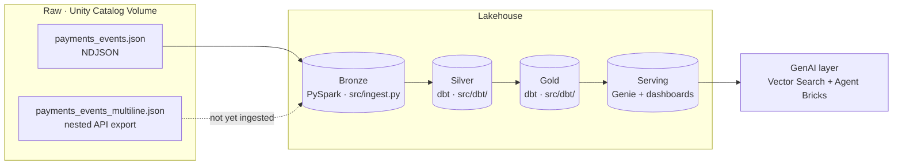

# NovaLake

A hands-on Databricks lakehouse build, end to end: raw event data → Bronze (PySpark)
→ Silver → Gold (dbt) → Serving (Genie) → a GenAI layer on top of the same curated
data — orchestrated by a Databricks Asset Bundle (DAB) from the first phase onward,
deployed via CLI now and CI/service-principal later. Lakeflow Declarative Pipelines
is a later, comparative learning phase (`v0.7`), not the primary Silver/Gold path —
see `docs/checkpoint.md` for why. Built on **Databricks Free Edition**, documented
as it's built, every transformation and decision versioned in this repo.

NovaLake is the analytical/AI counterpart to **[NovaPay](#)** (a separate
production-style payments platform project) — NovaPay generates the operational
event stream; NovaLake is the lakehouse that turns it into business metrics, served
dashboards, and a support-assist AI agent.

## Why this exists

A structured way to go deep on Databricks: not tutorials, a real (synthetic) messy
dataset, transformed by hand through every layer before any orchestration or
automation is introduced — so each abstraction is understood before it's adopted.
See [`docs/checkpoint.md`](docs/checkpoint.md) for the explicit decision on *when*
agentic tooling (Claude Code + Databricks MCP) enters this build.

## Architecture



Bronze → Silver/Gold → Serving is orchestrated as one Databricks Asset Bundle job
from `v0.1` onward (`databricks.yml`, `resources/dbt_job.yml`). See
[`docs/architecture.md`](docs/architecture.md) for the DAB job graph and the
local-dev-vs-orchestrated-run split, and [`docs/adr/`](docs/adr/) for the decision
records behind this shape.

## Roadmap

| Tag | Phase | What it builds | Learn |
|-----|-------|-----------------|-------|
| `v0.0` | Setup | Catalog, schemas, volume, Git folder | Workspace, Unity Catalog basics |
| `v0.1` | Bronze | `src/ingest.py` PySpark ingest, wrapped in a DAB job resource | Ingestion, schema-on-read, DAB from day one |
| `v0.2` | Silver | dbt models + tests: explode/flatten, drift reconciliation, dedupe, DLQ | Real PySpark/SQL transformation, dbt |
| `v0.3` | Gold | dbt models: business metrics, conformed dimensions | Aggregation, dimensional modeling |
| `v0.4` | Serving | Genie space on Gold, dashboard/feature tables | Serving patterns, AI/BI |
| `v0.5` | CI/CD | GitHub Actions, service-principal deploy, `bundle validate` gate, `prod` target | Continuous deployment |
| `v0.6` | GenAI | Vector Search + Agent Bricks support-assist RAG, text-to-SQL | RAG, agents, eval |
| `v0.7` | Declarative Pipelines (compare) | Re-implement part of Gold with Lakeflow Declarative Pipelines | Declarative ETL, DQ-as-code, vs. dbt |
| — | Cross-cutting | Unity Catalog governance, observability | Continuous, from `v0.1` onward |

Each tag = a tagged GitHub release: the table/asset works, the logic is committed,
the doc module is filled, and the validation checklist is green.

## Repo structure

```
novalake/
├── README.md
├── CONTRIBUTING.md
├── databricks.yml         # Asset Bundle root — dev target (prod added at v0.5)
├── resources/
│   └── dbt_job.yml        # bronze ingest task -> dbt_task (Silver/Gold)
├── src/
│   ├── ingest.py           # PySpark: land + flatten the raw JSON (Bronze)
│   └── dbt/                # dbt project: Silver/Gold models + tests
├── dbt_profiles/
│   └── profiles.yml       # env_var()-based, local dbt dev only
├── requirements-dbt.txt   # dbt-databricks pin, local dev only
├── data/
│   ├── generators/        # synthetic dataset generators (reproducible)
│   └── dictionaries/      # what's in the data + the deliberate challenges
├── notebooks/             # historical: the original hand-run v0.1 Bronze notebook
├── docs/
│   ├── checkpoint.md      # pinned process decisions (e.g. agentic integration timing)
│   ├── _skeleton.md        # reusable doc module template
│   └── 00-setup.md, ...    # one filled module per phase
├── pipelines/             # Lakeflow Declarative Pipeline source (from v0.7, comparative)
└── .github/workflows/     # CI (from v0.5, deploys via service principal)
```
`pipelines/` and `.github/workflows/` aren't created yet — added when their phase
starts, not pre-scaffolded. See `docs/checkpoint.md` for the DAB/dbt timing
decisions and why `pipelines/` moved from `v0.6` to a later comparative phase.

## Status

✅ `v0.2` Silver complete and merged to `main`, tagged `v0.2` — all 10 event
types across both raw sources (dedupe, envelope + payload drift-fix, DLQ split,
array explode, dynamic-map reconstruction, cross-page dimension resolution, fx
normalization, reconciliation; see [`docs/02-silver.md`](docs/02-silver.md)).
81 dbt models, verified locally and via a real DAB job run.

✅ `v0.3` Gold complete and merged to `main`, tagged `v0.3` — 20 Gold models
(conformed `dim_date`/`dim_customers`/`dim_merchants`, 8 fact tables, 9 metric
rollups) on top of Silver, every fact's row count verified against its source
`_clean` models; see [`docs/03-gold.md`](docs/03-gold.md).

✅ `v0.4` Serving complete on `main` — Genie space ("NovaLake Gold Analytics")
and a 3-page/11-dataset AI/BI dashboard on Gold, both deployed, validated
live, and wired into the DAB bundle (`resources/dashboard.yml`); see
[`docs/04-serving.md`](docs/04-serving.md). Not yet tagged `v0.4`.
