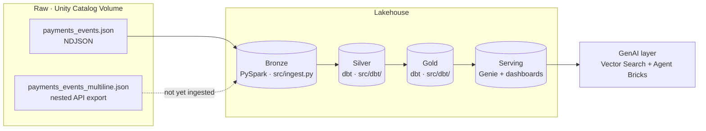

# NovaLake

A hands-on Databricks lakehouse build, end to end: raw event data → Bronze (PySpark)
→ Silver → Gold (dbt) → Serving (Genie) → a GenAI layer on top of the same curated
data — orchestrated by a Databricks Asset Bundle (DAB) from the first phase onward,
deployed via CLI now and CI/service-principal later. Lakeflow Declarative Pipelines
is a later, comparative learning phase (`v0.7`), not the primary Silver/Gold path —
see `docs/checkpoint.md` for why. Built on **Databricks Free Edition**, documented
as it's built, every transformation and decision versioned in this repo.

NovaLake is the analytical/AI counterpart to **[NovaPay](#)** (a separate
production-style payments platform project) — NovaPay generates the operational
event stream; NovaLake is the lakehouse that turns it into business metrics, served
dashboards, and a support-assist AI agent.

## Why this exists

A structured way to go deep on Databricks: not tutorials, a real (synthetic) messy
dataset, transformed by hand through every layer before any orchestration or
automation is introduced — so each abstraction is understood before it's adopted.
See [`docs/checkpoint.md`](docs/checkpoint.md) for the explicit decision on *when*
agentic tooling (Claude Code + Databricks MCP) enters this build.

## Architecture


```mermaid
flowchart LR
    subgraph Raw["Raw · Unity Catalog Volume"]
        A["payments_events.json<br/>NDJSON"]
        B["payments_events_multiline.json<br/>nested API export"]
    end
    subgraph Lakehouse
        C[("Bronze<br/>PySpark · src/ingest.py")]
        D[("Silver<br/>dbt · src/dbt/")]
        E[("Gold<br/>dbt · src/dbt/")]
        F[("Serving<br/>Genie + dashboards")]
    end
    G["GenAI layer<br/>Vector Search + Agent Bricks"]

    A --> C
    B -.not yet ingested.-> C
    C --> D --> E --> F
    F --> G
```

Bronze → Silver/Gold → Serving is orchestrated as one Databricks Asset Bundle job
from `v0.1` onward (`databricks.yml`, `resources/dbt_job.yml`). See
[`docs/architecture.md`](docs/architecture.md) for the DAB job graph and the
local-dev-vs-orchestrated-run split, and [`docs/adr/`](docs/adr/) for the decision
records behind this shape.

## Roadmap

| Tag | Phase | What it builds | Learn |
|-----|-------|-----------------|-------|
| `v0.0` | Setup | Catalog, schemas, volume, Git folder | Workspace, Unity Catalog basics |
| `v0.1` | Bronze | `src/ingest.py` PySpark ingest, wrapped in a DAB job resource | Ingestion, schema-on-read, DAB from day one |
| `v0.2` | Silver | dbt models + tests: explode/flatten, drift reconciliation, dedupe, DLQ | Real PySpark/SQL transformation, dbt |
| `v0.3` | Gold | dbt models: business metrics, conformed dimensions | Aggregation, dimensional modeling |
| `v0.4` | Serving | Genie space on Gold, dashboard/feature tables | Serving patterns, AI/BI |
| `v0.5` | CI/CD | GitHub Actions, service-principal deploy to `dev`, `bundle validate` PR gate | Continuous deployment |
| `v0.6` | GenAI | Vector Search + Agent Bricks support-assist RAG, text-to-SQL | RAG, agents, eval |
| `v0.7` | Declarative Pipelines (compare) | Re-implement part of Silver with Lakeflow Declarative Pipelines — retargeted from Gold, see [ADR-0010](docs/adr/0010-v0.7-silver-not-gold-comparison-target.md) | Declarative ETL, DQ-as-code, vs. dbt |
| `v0.9` | Spark optimization (final phase) | Query profiles, `EXPLAIN`, liquid clustering, `OPTIMIZE`, join/skew tuning — within serverless's constraints, on GB-scale regenerated data | Spark optimization NovaLake's compute model can actually expose |
| — | Cross-cutting | Unity Catalog governance, observability | Continuous, from `v0.1` onward |

Each tag = a tagged GitHub release: the table/asset works, the logic is committed,
the doc module is filled, and the validation checklist is green.

**No `v0.8`.** It was left reserved, not yet scoped, through `v0.7`'s
completion — [ADR-0008](docs/adr/0008-novalake-terminus-and-cerberus-succession.md)
pre-authorized exactly this outcome: no concrete need for a standalone `v0.8`
phase ever surfaced, so per that ADR's own contingency the roadmap collapses
`v0.7` → `v0.9` directly rather than inventing content to fill the slot.

**`v0.9` is NovaLake's terminus** — there is no `v0.10`. Serverless compute
structurally can't expose infra-level Spark tuning (no Spark UI, no cluster
sizing, most `spark.conf` locked) or real dev/prod environment isolation
(one Free Edition workspace). Rather than fake either inside NovaLake, both
succeed to a new project, **Cerberus** — AWS, Terraform-first IaC, classic/
self-managed Spark compute, with NovaPay (the companion payments app) as
its upstream data producer. See
[ADR-0007](docs/adr/0007-defer-prod-no-same-workspace-production-semantics.md)
and [ADR-0008](docs/adr/0008-novalake-terminus-and-cerberus-succession.md)
for the full reasoning.

## Repo structure

```
novalake/
├── README.md
├── CONTRIBUTING.md
├── CLAUDE.md              # repo-aware conventions + agentic-access rules (from v0.6)
├── databricks.yml         # Asset Bundle root — dev target only, no prod (see ADR-0007)
├── resources/
│   ├── dbt_job.yml        # bronze ingest task -> dbt_task (Silver/Gold)
│   ├── dashboard.yml      # AI/BI dashboard on Gold (v0.4)
│   ├── vector_search.yml  # RAG endpoint + indexes (v0.6)
│   ├── dlt_pipeline.yml   # Declarative Pipelines comparison (v0.7)
│   └── dbt_job_gb.yml     # GB-scale medallion rebuild, parameterized (v0.9)
├── src/
│   ├── ingest.py           # PySpark: land + flatten the raw JSON (Bronze)
│   ├── dbt/                # dbt project: Silver/Gold models + tests
│   └── genai/               # RAG agent, eval, deploy/teardown scripts (v0.6)
├── pipelines/
│   └── transformations/    # Lakeflow Declarative Pipelines SQL (v0.7, comparative)
├── dbt_profiles/
│   └── profiles.yml       # env_var()-based, local dbt dev only
├── requirements-dbt.txt   # dbt-databricks pin, local dev only
├── data/
│   ├── generators/        # synthetic dataset generators (reproducible)
│   └── dictionaries/      # what's in the data + the deliberate challenges
├── notebooks/             # historical: the original hand-run v0.1 Bronze notebook
├── docs/
│   ├── checkpoint.md      # pinned process decisions (e.g. agentic integration timing)
│   ├── _skeleton.md        # reusable doc module template
│   ├── adr/                # one-decision-per-file architecture records
│   ├── notes/               # ad-hoc reference notes (e.g. a v0.6 UI walkthrough)
│   └── 00-setup.md, ...    # one filled module per phase, through 09-spark-optimization.md (v0.9)
└── .github/workflows/     # CI (from v0.5, deploys via service principal)
```
Each phase's directories/resource files were added when that phase actually
started, not pre-scaffolded ahead of time — `pipelines/` at `v0.7`,
`src/genai/`/`resources/vector_search.yml` at `v0.6`, `.github/workflows/`
at `v0.5`. See `docs/checkpoint.md` for the reasoning behind that
discipline and the DAB/dbt sequencing decisions.

## Status

✅ `v0.2` Silver complete and merged to `main`, tagged `v0.2` — all 10 event
types across both raw sources (dedupe, envelope + payload drift-fix, DLQ split,
array explode, dynamic-map reconstruction, cross-page dimension resolution, fx
normalization, reconciliation; see [`docs/02-silver.md`](docs/02-silver.md)).
81 dbt models, verified locally and via a real DAB job run.

✅ `v0.3` Gold complete and merged to `main`, tagged `v0.3` — 20 Gold models
(conformed `dim_date`/`dim_customers`/`dim_merchants`, 8 fact tables, 9 metric
rollups) on top of Silver, every fact's row count verified against its source
`_clean` models; see [`docs/03-gold.md`](docs/03-gold.md).

✅ `v0.4` Serving complete and merged to `main`, tagged `v0.4` — Genie space
("NovaLake Gold Analytics") and a 3-page/11-dataset AI/BI dashboard on
Gold, both deployed, validated live, and wired into the DAB bundle
(`resources/dashboard.yml`); see [`docs/04-serving.md`](docs/04-serving.md).

✅ `v0.5` CI/CD complete and merged to `main` ([PR #5](https://github.com/ChiragVenkateshaiah/novalake/pull/5))
— GitHub Actions (`bundle validate` PR gate, fail-safe `bundle deploy` on
merge) automating the existing `dev` deploy via the `novalake-cicd`
service principal (secret-based OAuth M2M — Free Edition doesn't expose
OIDC federation, see
[ADR-0006](docs/adr/0006-secret-based-service-principal-auth-for-cicd.md)).
No `prod` target — real production semantics are out of scope for this
single-workspace project; see
[ADR-0007](docs/adr/0007-defer-prod-no-same-workspace-production-semantics.md)
and [ADR-0008](docs/adr/0008-novalake-terminus-and-cerberus-succession.md)
(NovaLake's terminus at `v0.9`, succeeded by Cerberus).
`bundle-validate.yml` caught and fixed a real unpinned-`root_path` bug on
its first real run; `bundle-deploy.yml` ran for real on merge and
succeeded, deploying to the existing `dev` job/dashboard in place (verified
directly in the workspace UI, no parallel copies). See
[`docs/05-cicd.md`](docs/05-cicd.md).

✅ `v0.6` GenAI complete and merged to `main`, tagged `v0.6` — scoping
([PR #6](https://github.com/ChiragVenkateshaiah/novalake/pull/6)) established
[ADR-0009](docs/adr/0009-agentic-integration-mcp-gated-review-then-act.md)
(Claude may invoke Databricks MCP actions directly from `v0.6` on, gated by
per-action review — the checkpoint's `v0.6` re-open, fulfilled). Two step-
groups, both shipped: **RAG** (`fct_support_tickets.description` and
`fct_reviews.title`/`body` promoted to Gold as the corpus, two new physical
Delta tables synced via a shared `novalake-rag` Vector Search endpoint, a
custom MLflow `ResponsesAgent` deployed to Model Serving, offline-evaluated
— a real prompt-injection vulnerability was found and fixed via manual
trace auditing) and **text-to-SQL** (an Agent Bricks Supervisor Agent
routing to the existing Genie space; found and documented that certified-
example SQL reuse is non-deterministic, a genuine Genie limitation, not a
regression). See [`docs/06-genai.md`](docs/06-genai.md) and
[`docs/notes/assistant-notes.md`](docs/notes/assistant-notes.md) for a UI
walkthrough of everything built.

✅ `v0.7` Declarative Pipelines complete and merged to `main`, tagged `v0.7`
— re-implemented the `transaction.*`/ndjson Silver slice
(`stg_raw_events → int_events_deduped → int_transactions →
int_transactions_clean`/`int_transactions_dlq`) in Lakeflow Declarative
Pipelines SQL, comparing directly against the existing dbt implementation
in parallel `_dlt`-suffixed schemas — a deliberate retarget from Gold to
Silver, see [ADR-0010](docs/adr/0010-v0.7-silver-not-gold-comparison-target.md).
Two genuine empirical findings, both resolved live rather than assumed:
DLT rejects `ROW_NUMBER()` on a streaming table outright
(`NON_TIME_WINDOW_NOT_SUPPORTED_IN_STREAMING`), resolving a real conflict
between the DLT skill's own example and the general Spark streaming rule;
and `EXPECT ... ON VIOLATION DROP ROW` cannot produce an inspectable DLQ —
confirmed by triggering a real 150-row violation and finding the event log
exposes only an aggregate count, never row content — so dbt's `_clean`/
`_dlq` two-model split does something DLT's own headline primitive
genuinely can't replace. Exact row-count, content, and expectation parity
against the dbt original on every check. See
[`docs/07-declarative-pipelines.md`](docs/07-declarative-pipelines.md).

✅ `v0.9` Spark Optimization complete, tagged `v0.9` — **NovaLake's
terminus, no `v0.10`.** GB-scale regeneration first
([ADR-0011](docs/adr/0011-gb-scale-data-regeneration.md)): both generators
rewritten for bounded-memory chunked/streaming output (a new
`--skew-merchant-ids` knob added to both), ~5,000,000 events landed across
`bronze_gb`/`silver_gb`/`gold_gb` (revised down from an original 25M target
after a pilot run's real cost-per-GB measurement), all 101 applicable dbt
models rebuilt against the full-scale data. A real generator bug surfaced
and fixed along the way: the multiline generator never cleared its output
directory between runs, so a full-scale run silently picked up 20 stale
pilot-scale files alongside its own, corrupting `fct_transactions` with
122,592 duplicate keys — root-caused via direct file listing, fixed
permanently, remediated via a scoped local `dbt` rebuild. Confirmed live
that Unity Catalog's 100-table/schema quota is a genuine,
practically-non-raisable Free Edition override of the general 10,000/schema
default (ADR-0011 addendum).

Then `§8`'s six ADR-0008-named optimization techniques, each with a real,
evidence-backed before/after result (see
[`docs/09-spark-optimization.md`](docs/09-spark-optimization.md)): liquid
clustering showed a clean null result on the real (2-file) `fct_transactions`
and a clean win once forced past the file-count threshold on a scratch copy
(files 8→1, bytes −89%); `OPTIMIZE`/file compaction cut a genuinely
fragmented Bronze table's files 20→4 with a real, causally-explained 60%
duration drop; join strategy confirmed Spark's own default (broadcast/
shuffle-hash) already beats any forced alternative, with `MERGE`/
`SortMergeJoin` falling out of Photon acceleration entirely; skew handling
quantified a real clustering failure under deliberate skew
(`approxClusteringQuality: 0.0`), honestly reported as a partly-unresolved
open question after three follow-up attempts didn't unstick it; UDF
elimination showed a constructed Python UDF running ~2.6x slower than the
native SQL macro it mirrors, forcing the *entire* downstream query plan out
of Photon, not just the UDF step. Both deliberately-constructed pedagogical
artifacts (the skew knob, the demonstration UDF) are formally recorded in
[ADR-0012](docs/adr/0012-deliberate-skew-and-udf-antipattern-injection.md).
Real platform-methodology findings along the way, reusable for future work:
`system.query.history` has no documented freshness SLA; the SQL result
cache matches on logical result equivalence, not literal query text,
requiring an explicit session to reliably bypass; Predictive Optimization is
genuinely active on this workspace despite being invisible to
`SHOW TBLPROPERTIES`. See
[`docs/09-spark-optimization.md`](docs/09-spark-optimization.md) for the
full technical narrative.
