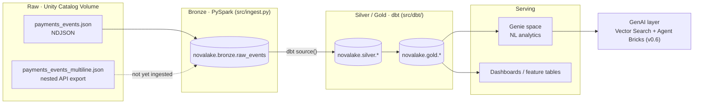
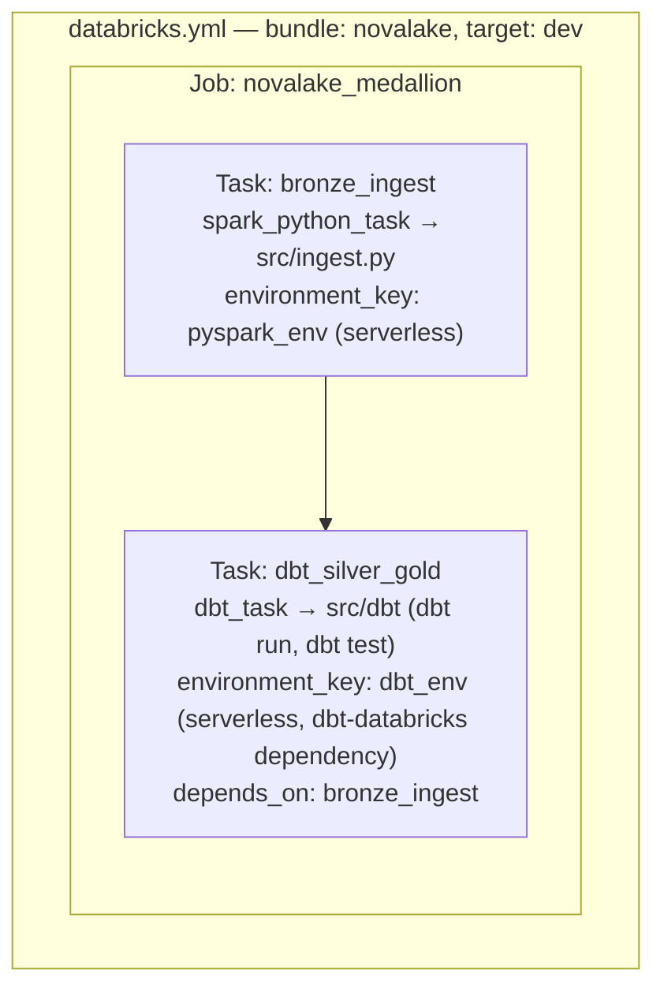
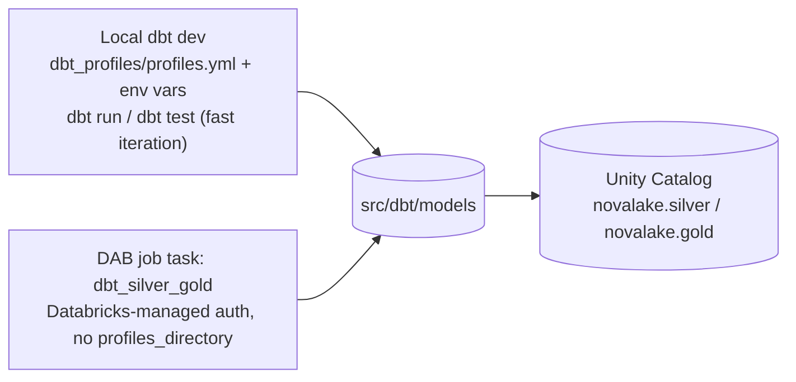

# Architecture

Two diagrams: the medallion data flow (what tool owns each layer), and the
Databricks Asset Bundle (DAB) orchestration graph (how the job actually runs).
See `docs/checkpoint.md` and `docs/adr/` for the decisions behind this shape.

## 1. Data flow

**Per-layer ownership:**

| Layer | Tool | Where | Why this tool |
|-------|------|-------|----------------|
| Bronze | PySpark | `src/ingest.py` | Genuinely messy nested/polymorphic JSON — schema inference, `from_json`, explode/quarantine logic is where Spark earns its place; dbt can't touch raw JSON like this. |
| Silver / Gold | dbt | `src/dbt/models/` | SQL models + tests — version-controlled, environment-aware, the project's SDLC layer. Replaces the originally-planned Lakeflow Declarative Pipelines for this role (see [ADR-0002](adr/0002-use-dbt-for-silver-gold.md)). |
| Serving | Genie | Databricks workspace (Genie space over Gold) | Natural-language analytics for anyone who doesn't want to write SQL against Gold. |
| Orchestration | DAB | `databricks.yml`, `resources/*.yml` | Deploys and wires Bronze → Silver/Gold as one job, from `v0.1` onward (see [ADR-0001](adr/0001-adopt-dab-from-v0.1.md)). |

## 2. DAB job graph

What `databricks bundle deploy` actually creates, per `resources/dbt_job.yml`:

**Two ways `src/dbt/` actually gets run**, and they're deliberately different loops:

Local dbt (`requirements-dbt.txt`) is for day-to-day model development — the fast
loop dbt is built for. The DAB `dbt_task` is for orchestrated/scheduled runs, not
primary development; see [ADR-0004](adr/0004-local-dbt-development-workflow.md).

## Targets

Only `dev` exists today (`databricks.yml`). `prod` is intentionally not
pre-scaffolded — it arrives at `v0.5` (CI/CD) alongside the service-principal
deploy it actually requires. See [ADR-0003](adr/0003-dev-only-bundle-target.md).
