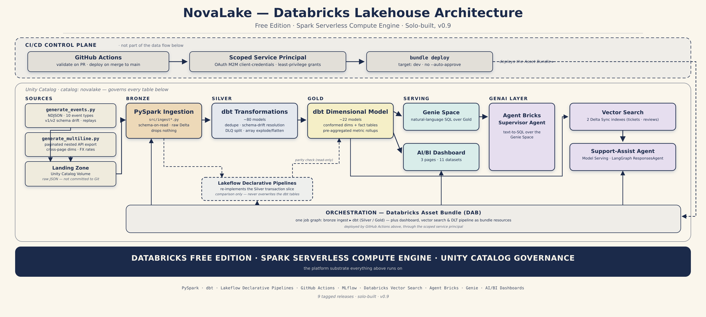

<!--
MEDIUM METADATA — Part 1 of 8
Title:      The platform is the only source of truth
Subtitle:   A green checkmark that was quietly wrong, and the four-stage escalation that governed an AI agent's access for nine releases. (131 chars)
Cover:      ../poster/part-1-collaboration-model.png
SEO title:  The platform is the only source of truth (39)
SEO desc:   Building a Databricks lakehouse end to end, with an AI agent on a short, documented leash. Part 1: the collaboration model. (126)
Tags:       Databricks, Data Engineering, Artificial Intelligence, PySpark, Software Engineering
Source:     docs/articles/novalake-full-story.md — lines 1-52, verbatim
-->

# The platform is the only source of truth

### Building a Databricks lakehouse end to end — one day to stand up Bronze, a month-long gap, then a nine-day sprint to the finish — with an AI agent on a short, documented leash, and keeping every place a reasonable assumption lost to a real run

*Part 1 of 8. Next: [Bronze, and the confidently wrong fix](LINK-PART-2) →*

---

A GitHub Actions run passed. Green checkmark, required check satisfied, PR mergeable. The workflow was `bundle validate` against my Databricks Asset Bundle, and it did exactly what it was supposed to do: parsed the YAML, resolved the target, reported success.

It was also, quietly, wrong. Because I hadn't pinned `root_path` in `databricks.yml`, the `dev` target resolved to *whichever identity was deploying's own home folder*. Locally, that was mine. In CI, it was the service principal's Application-ID folder. The validate step didn't care — validation doesn't simulate a deploy. But the next step in the pipeline, `bundle deploy`, would have happily created a **parallel job and a parallel dashboard** under the service principal's folder, sitting next to the real ones, silently defeating every least-privilege grant I'd just spent an hour scoping. Nothing would have failed. There would have been two of everything.

I caught it because I read the CI log output — it prints the resolved path — instead of just looking at the badge. That's the whole project in one incident, and it's why I wrote this: **a green checkmark isn't proof of correctness, it's proof that one specific check didn't fail.** NovaLake shipped as nine tagged releases in two bursts: `v0.0` and `v0.1` — catalog setup and Bronze — landed in one day, 2026-06-24. Then nothing, for almost a month. Then `v0.2` through `v0.9` — Silver, Gold, Serving, CI/CD, GenAI, the DLT comparison, and GB-scale Spark optimization — shipped in a nine-day sprint, 2026-07-20 through 2026-07-29. That lesson showed up at every single layer of both bursts, in a slightly different costume each time.

---

## What NovaLake is, and why it exists

NovaLake is a Databricks lakehouse built end to end on Free Edition: raw event data → Bronze (PySpark) → Silver → Gold (dbt) → Serving (a Genie space and an AI/BI dashboard) → a GenAI layer (RAG agent + text-to-SQL) on top of the same curated data, orchestrated by a Databricks Asset Bundle from the first phase onward, with GitHub Actions CI, a comparative Lakeflow Declarative Pipelines (DLT) implementation, and a final Spark optimization phase on GB-scale regenerated data.

It exists because I wanted to learn the Databricks stack properly rather than by tutorial — which to me meant three non-negotiables:

1. **Real messy data.** Not a clean CSV. A synthetic payments-platform event stream with deliberately injected defects: 10 polymorphic event types keyed off a `payload` shape, schema drift between `schema_version` `"1.0"` and `"2.0"`, a field that's a struct 97% of the time and a bare string the other 3%, epoch-zero and year-2099 sentinel timestamps, ~1.5% replayed `event_id`s, currency values like `"usd"` and `" GBP"` and `"US$"`, and a second source that's a pretty-printed JSON array of paginated API export pages with 3–4 levels of nesting, cross-page dimension drift, and an escaped-JSON dead-letter array.

2. **Real engineering hygiene.** One branch per module. Conventional Commits. A Definition of Done per phase (table queryable, logic committed to its actual home, phase doc filled in sections 1–9 minimum, validation checklist green, tagged release pushed). Twelve Nygard-style ADRs, immutable once accepted — corrections get a new ADR, never a silent edit to an old one. A phase doc per module following a fixed 12-section template.

3. **Human before automation.** I built each layer by hand, understood it, then wrapped it. And I brought an AI agent (Claude Code) into the loop deliberately gradually — never with the keys up front — with the access model itself versioned as a decision document that got revised in writing, in place, whenever it needed correcting.

NovaLake is also the analytical counterpart to a separate payments-platform project of mine, NovaPay. NovaPay produces the operational event stream; NovaLake is the lakehouse that turns it into metrics, dashboards, and a support-assist agent.

It is complete. Tagged `v0.9`. That's a deliberate terminus, not an abandonment — I'll come back to why at the end.

---

## The architecture, and where this part sits

The diagram above has three horizontal bands, and the distinction between them is what makes the rest of this series legible.

**The data plane** is the left-to-right spine: two synthetic generators write raw JSON into a Unity Catalog Volume (the landing zone), PySpark ingests it to Bronze as Delta, ~80 dbt models resolve it through Silver, ~22 more conform it into Gold, and two consumers sit on top of Gold — a Genie space and an AI/BI dashboard for humans, a Vector Search + agent layer for the GenAI surface. Each of the seven parts that follow lights up one segment of that spine.

**The control plane** sits above it and never touches data. GitHub Actions authenticates as a scoped service principal and runs `databricks bundle deploy`. That's the only sanctioned path from a merged PR to a changed workspace.

**Unity Catalog** wraps everything below, governing every table in the spine.

The thing worth noticing is that **the Databricks Asset Bundle covers the entire diagram from the first phase onward** — the bronze ingest job, the dbt tasks, the dashboard, the vector search resources and the DLT pipeline are all bundle resources in one job graph, not a pile of separately-clicked artifacts. That single fact is what makes this part's subject matter tractable: because every layer deploys through one mechanism, the AI access question reduces to one question — who is allowed to run `bundle deploy`, and under what review — rather than a different answer per service.

Which is exactly what the four-stage escalation below is an answer to.

---

## Part I: The collaboration model, because it's the part people get wrong

Most "I built X with AI" writeups have exactly two settings: *the AI did everything* or *the AI is a fancy autocomplete*. Neither is useful. What I actually ran was a four-stage escalation where each stage had a written trigger, a written scope, and a written log.

**Stage 1 — Fully hands-off (`v0.0`–`v0.4`).** Claude acted as an architect and reviewer in chat only. Zero repo write access, zero workspace write access. It proposed, I typed. Every `databricks bundle deploy`, every notebook run, every dbt invocation was mine.

**Stage 2 — One-off exceptions (`v0.4`).** Two narrow, explicitly-requested exceptions during the Serving phase: a read-only dashboard export, then later a `bundle deploy` + publish for that same dashboard. Each was logged in my checkpoint file as a *deliberate one-off*, with the explicit note that the hands-off principle applies again from the next action. Not a rule change. This distinction matters more than it sounds: the failure mode of granting AI access is not one dramatic bad action, it's a ratchet where each exception silently becomes the new baseline.

**Stage 3 — Draft-and-approve (`v0.5`).** "Claude drafts every file, Chirag applies and deploys everything himself." Fast on the mechanical work, zero delegation of execution. Identity-sensitive actions — creating the service principal, generating its OAuth client secret — stayed 100% mine regardless of stage. Claude never saw the secret value.

**Stage 4 — Gated review-then-act (`v0.6` onward).** This is the interesting one, and it got its own ADR. From the GenAI phase on, Claude could invoke Databricks MCP tool calls with side effects directly — but **every** side-effecting call required presenting the *exact tool call and its full parameter set*, not a prose summary, and waiting for explicit go-ahead. Read-only calls (`list`/`get`, vector index queries, `SELECT`/`SHOW`/`DESCRIBE`/`EXPLAIN`) were ungated so the iteration loop could actually move. Writes were gated by name, with an explicit rule that nothing is gated-by-omission — including the one that's easy to mis-file: a vector index *upsert* is a write, not "just search."

Two rules made stage 4 survivable rather than theatrical:

- **Every executed gated action gets logged**, dated, with the tool call, parameters, and outcome. The reasoning is precise: a skipped log entry for a file change still leaves a git diff. A skipped log entry for a live MCP action leaves *nothing at all*.
- **Deleting a wrongly-created live resource is itself a gated action.** There is no `git revert` for a provisioned Vector Search endpoint.

Did it hold? Mostly, and the interesting data is where it didn't. At least once, Claude created an ad-hoc test job without presenting it for review first — caught itself, disclosed before running it, and got a go-ahead. Separately, Claude Code's own auto-mode permission classifier independently blocked several calls that ADR-0009 would have allowed after review — a harness-level gate operating on completely different logic from my human-review discipline, which is worth knowing about if you're designing one of these: **you will have two gates, they will not agree, and you need to know which one just stopped you.**

And one genuinely instructive failure: a `databricks bundle deploy` that was only *meant* to update one job resource deployed all of `resources/*.yml`, and as a side effect recreated a Vector Search endpoint I had deliberately deleted the previous session (Vector Search endpoints have no scale-to-zero; they burn quota continuously until deleted). That specific side effect should have been named in the gated proposal *before* the deploy, not discovered from the resulting error. It happened twice before the third proposal named it explicitly up front — which is exactly the kind of thing a process log is for.

---

## What's coming in this series

Eight parts, one per layer of the build, each with the failures left in:

| Part | What it covers |
|---|---|
| **1** | The collaboration model — four stages of AI access *(you are here)* |
| **2** | Bronze, and the confidently wrong fix |
| **3** | Silver and Gold — two pipelines deliberately never unified |
| **4** | Serving and CI/CD — guardrails, and a green check that lied |
| **5** | The agent that leaked its own system prompt |
| **6** | DLT versus dbt, and getting to GB scale |
| **7** | Four experiments that produced numbers |
| **8** | The one that didn't resolve, and what I'd take from this |

**Next up — [Part 2: Bronze, and the confidently wrong fix](LINK-PART-2).** 51 inferred leaf fields, two of them lying, an audit tool whose own null filter silently never fired, and the moment a sound general principle produced advice that was confident, reasonable, and wrong.

*Part 1 of 8. Full repo: [GitHub](LINK-REPO)*
